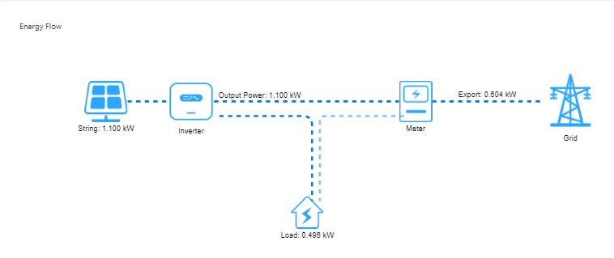

# Fusion Solar EnergyFlow Scrapper

A python script that logs into the Fusion Solar Huawei website and takes a screenshot of the Energy Flow Screen.

<div style="text-align:center">

</div>

### Requirements 🧱

- Chrome
- ChromeDriver

## Build 🚀

Install virtualenv via pip:
```bash
pip install virtualenv
```
Create a virtual environment for a project:
```bash
$ cd project_folder
$ virtualenv venv
```
To begin using the virtual environment, it needs to be activated:
```bash
$ source ./env/bin/activate
```
Install the required packages
```bash
pip install -r requirements.txt
```